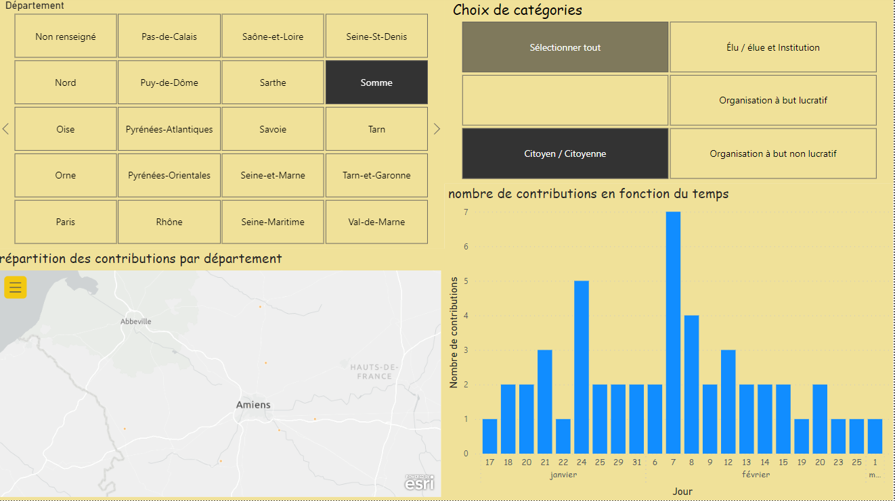
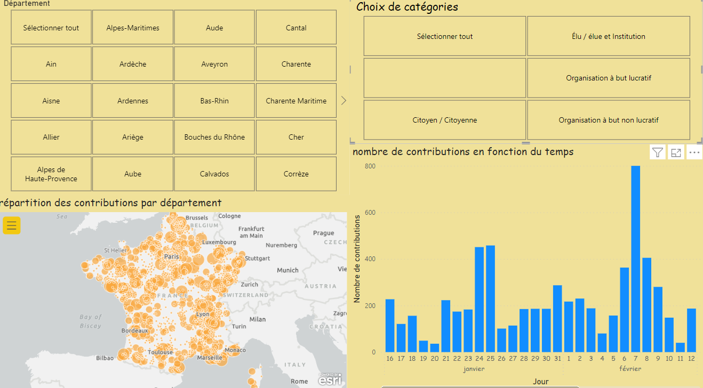

# Brief_Minority_Report

# Contexte du projet

Mission 1 : Vous êtes un spécialiste de la Data et vous êtes faites partie de l’équipe innovation qui travaille sur plusieurs projets. Vous devez présentez vos travaux devant la direction. Réalisez le dashboard suivant. Les données sont achats.csv, impressions.csv, clics.csv

Mission 2 : Vous avez été choisi par le gouvernement français pour créer un outil qui permet de visualiser les données d’une grande consultation nationale.
Votre mission Votre équipe a été mandatée pour réaliser un dashboard permettant de suivre les différentes contributions déposées. Les questions de la consultation sont réparties en grandes thématiques (économie, écologie...). Choisissez l’une d’elles, puis réalisez un dashboard qui permet de visualiser au moins ces 2 points : • le nombre de contributions en fonction du temps ; • la répartition des contributions par département. De plus, le dashboard devra proposer 2 filtres : • Un filtre sur le statut de la personne répondant au questionnaire, présent dans le champ authorType (ex : Citoyen·ne, Élu·e, etc.) • Un filtre sur le département de la personne

Mission 3 :

Vous êtes en mission pour une ONG ; elle a pour ambition de donner accès à l’eau potable à tout le monde.

DWFA présente 3 domaines d’expertises :
Création de services d’accès à l’eau potable ; Modernisation de services d’accès à l’eau déjà existants ; Consulting auprès d’administrations/gouvernements à propos des politiques d’accès à l’eau. L’association a effectué une demande de financement auprès d’un bailleur de fonds en présentant ces 3 domaines d’expertise. Ces nouveaux financements, s’ils sont accordés par le bailleur, pourront permettre d’investir dans un des domaines d’expertise dans un pays qui n’est pas encore déterminé. Dans ce cadre, vous êtes missionné pour réaliser un dashboard présentant une vue globale de l’accès à l’eau potable dans le monde. Celui-ci permettra de choisir le pays à cibler dès que le bailleur de fonds aura donné sa réponse sur le domaine d’expertise qu’il souhaite financer.

# Livrables
# Mission 2
(https://app.powerbi.com/groups/me/reports/f09147aa-e6a2-43de-846a-c7d335a17110/ReportSection0412fdf1456e20a26be5)
Nous avons utilisé Power BI qui est un outils de Dashboard,Power BI est une solution de Business Intelligence (BI) développée par Microsoft pour permettre aux entreprises de consolider, d’analyser, de visualiser et diffuser leurs données.

Le format des données en entrées utilisés sont des CSV.
Pour parvenu au resultat demander nous avons suivi un rapport détailler de ce que l'ont devait faire dans les missions.

# Mission 3
(https://app.powerbi.com/groups/me/reports/cae284ce-9013-489e-be50-e1e2015ebaee/ReportSection742a3cb593db0710817b)

Ce rapport de dashboard a été créé pour une ONG ayant pour ambition de donner accès à l'eau potable à tout le monde. Le rapport présente une vue globale de l'accès à l'eau potable dans le monde,mais aussi la qualité et la disponibilité de l'eau potable dans différents pays.

